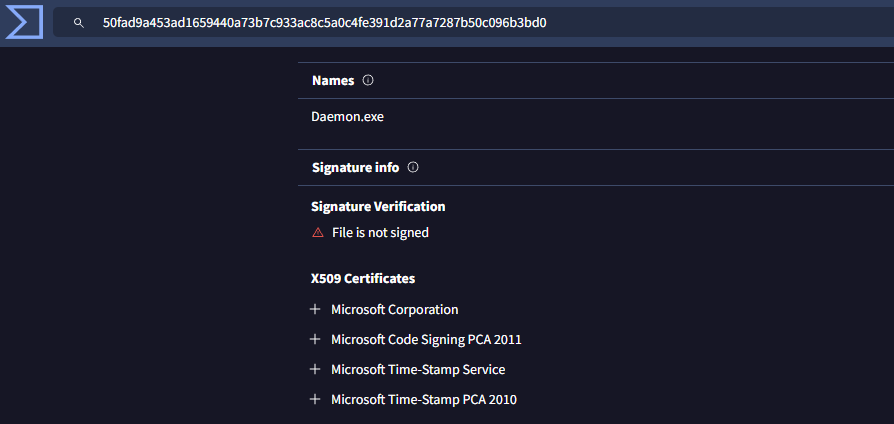

# Signature-stealer Toolkit


A Python-based toolkit for analyzing and modifying Portable Executable (PE) files, designed for red teaming and security research purposes.

## Features

- **PE Analysis**:
  - View headers and section information
  - Extract certificate and signature data
  - Analyze binary structure

- **Signature Manipulation**:
  - Extract certificates (`cert.bin`)
  - Extract complete signatures (`sign.bin`)
  - Inject certificates/signatures
  - Zero out certificate tables

- **Payload Injection**:
  - Find and utilize code caves
  - Inject shellcode/payloads
  - Modify entry points

- **Miscellaneous Modifications**:
  - Timestamp manipulation
  - Basic binary patching

## Sample image



## Installation

1. Clone the repository:
```bash
git clone https://github.com/LunaLynx12/Signature-stealer.git
cd pe-toolkit
```
2. Install dependencies:
```bash
pip install -r requirements.txt
```
3. Usage
```bash
python pe_toolkit.py -i <input_file> [options]
```
4. Basic Analysis
```bash
python pe_toolkit.py -i sample.exe -a
```
## Signature Operations

1. Extract certificate only
```bash
python pe_toolkit.py -i signed.exe --extract-cert cert.bin
```
2. Extract complete signature
```bash
python pe_toolkit.py -i signed.exe --extract-sig sing.bin
```
3. Inject signature
```bash
python pe_toolkit.py -i target.exe --inject-sig sing.bin
```
4. Zero out certificate table
```bash
python pe_toolkit.py -i target.exe --zero-cert
```
5. Payload Injection
```bash
python pe_toolkit.py -i target.exe --inject-payload shellcode.bin --update-entry
```
6. Timestamp Modification
```bash
python pe_toolkit.py -i target.exe --set-timestamp 0x5F943F31
```

## Components
* pe_toolkit.py: Main CLI interface

* pe_analyzer.py: PE file analysis module

* pe_modifier.py: Header modification functions

* sig_stealer.py: Signature/certificate operations

* payload_injector.py: Code cave finding and payload injection

## Warning
⚠️ This tool is for authorized security research and red teaming only.

⚠️ Signature stealing/injection will create invalid signatures that may trigger AV.

⚠️ Always test modifications in controlled environments.

## License
Copyright (C) 2025 LunaLynx12
